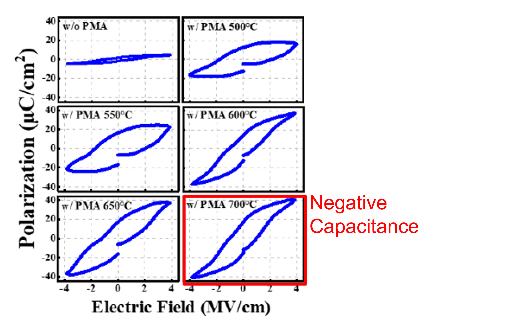
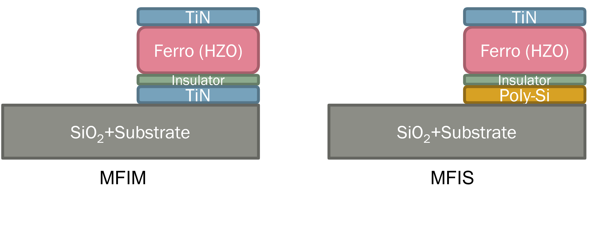
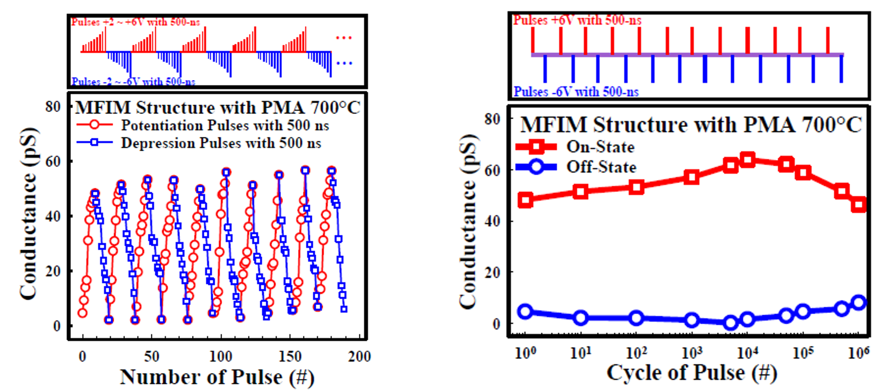
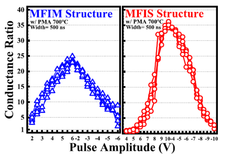
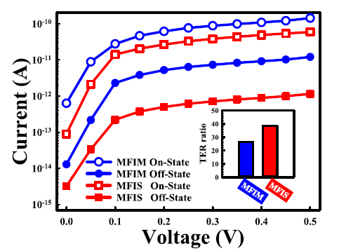
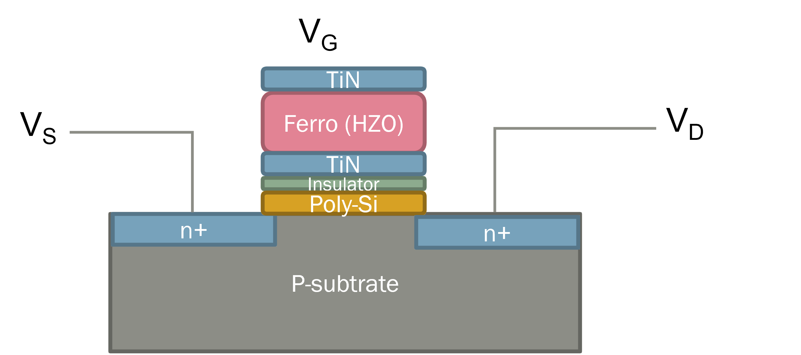
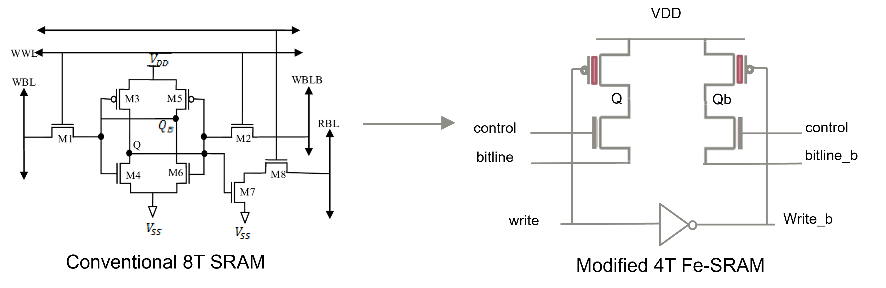
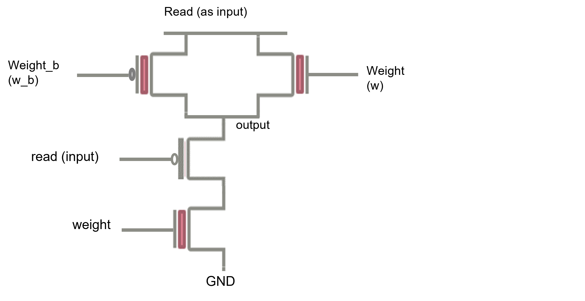

# Hardware Neural Network Based on Computation In-Memory with Ferroelectric Material
With the advancement of deep learning, the need for considerate computation grows significantly. It generally costs several days to train a robust model utilizing state-of-art convolutional neural network (CNN). People have dedicated to accelerate the training procedure in various aspects, e.g. hardware accelerating card, parallel computing strategies, and computation in-memory (CIM). Among them, CIM has the potential to eliminate redundant data access and is able to be adopted universally. This project attempts to implement logics according to this concept, therefore devising scalable circuit design. To further enhance the efficiency and capability of general use, I brought the novel ferroelectric material inside the semiconductor as gate region. This non-volatile material enabled state storage, which could be employed as neurons preserving weights. Theoretically, the designed convolution units could reduce 50% of execution time since it produced the desired result without complicated data fetching.

## Ferroeletric Material

### Metal-Ferro-Insulator-Metal

 

### Metal-Ferro-Insulator-PolySi

     

### Metal-Ferro-Metal-Insulator-PolySi

     

## Proposed Logic Circuit Design Optimization

### Modified SRAM

### Convolution Unit

## Contact Info
Author: Chun-Sheng Wu, MS student in Computer Engineering @ Texas A&M University  
Email: jinsonwu@tamu.edu  
LinkedIn: https://www.linkedin.com/in/chunshengwu/  

*This is project was implemented under the supervision of Dr. Jiun-In Guo & Dr. Tien-Shen Chao in National Chiao Tung University*
