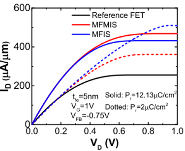

# Hardware Neural Network Based on Computation In-Memory with Ferroelectric Material
With the advancement of deep learning, the need for considerate computation grows significantly. It generally costs several days to train a robust model utilizing state-of-art convolutional neural network (CNN). People have dedicated to accelerate the training procedure in various aspects, e.g. hardware accelerating card, parallel computing strategies, and computation in-memory (CIM). Among them, CIM has the potential to eliminate redundant data access and is able to be adopted universally. This project attempts to implement logics according to this concept, therefore devising scalable circuit design. To further enhance the efficiency and capability of general use, I brought the novel ferroelectric material inside the semiconductor as gate region. This non-volatile material enabled state storage, which could be employed as neurons preserving weights. Theoretically, the designed convolution units could reduce 65% of execution time since it produced the desired result without complicated data fetching.

## Ferroeletric Material
Ferroelectric material, which is generally a HZO composition. has a special property named negative capacitance. It is caused by molecular structure alignment change due to input voltage. If we exert a positive input voltage on active regions, internal structure accordingly becomes in order, reduces the resistance of electrons transmission. This effect leads to current gap between on/off states in semiconductor. The polarization curve forms a hyteresis curve. It implies ferroelectric material has reversible capacitance change that can be used to store desired states. 

### Metal-Ferro-Insulator-Metal
There are several stacking methods compared in this project. The firstly proposed one is Metal-Ferro-Insulator-Metal (MFIM) structure. Metal layer is used as conductive route for electrons passing through amorphous/crystalline ferroelectric material. The bottom left graph exhibits the behavior once a positive (potential) pulse and a negative (depression) pulse imposed on the device. 

  

Below left graph shows how the stacking looks like when we apply ferroelectric material as gate on tunneling junction transistor (TJT). The right one represents Metal-Ferro-Insulator-PolySi stacking.

 

### Metal-Ferro-Insulator-PolySi
To better enhance the conductance while providing potential to the ferroelectric transistor, we replaced the metal to PolySi for reaching better constraint while electron transmits. This in return gave us a great success, it outperformed the prior MFIM one about 30% from conductance comparison. 

     

### Metal-Ferro-Metal-Insulator-PolySi
We further tried to combine above-mentioned two concepts and further improve the active current. Utilized metal before the insulator layer to place a great path shut transmitting desired current. The last PolySi could give great selectivity here without interfering operations beforehand. Considering all the conditions, MFMIS was chosen to be the ultimate candidate exploiting on proposed circuit design.

     

## Proposed Logic Circuit Design Optimization
Here, I will introduce several optimization strategies in aspect of ferroelectric material (especially MFMIS transistor) on conventional circuits. The first one is to replace the normal CMOS on storage memory, that is static random access memory (SRAM) in this project. With the help of this non-volatile material, the modified SRAM is promising to reduce 50% of area and power accordingly. As for the convolution unit design, I devise a simple circuit based on XOR and a precusoring source change circuit to fulfill the logic semantics. Theoretically, this scalable convolutional network is able to provide 65% execution time reduction due to the elimination of data fetching.

### Modified SRAM
The modified SRAM only requires half of the transistors (4FeFET) than conventional 8T SRAM. In the meantime, it keeps the similar read/write accessibility. Besides, it enables dynamic modulation by synchronizing controls with time signal (GHz). The instructions about read/write operations showing in the following:

**Read** 
- bitline & bitline_b & control precharge to "1"
- "0" will pass from Q/Q_b
- Turn control & bitline & bitline_b into "0" to regain initial states (GND depends on pipelining)
- Float ports to stabilize the circuit

**Write**
- Precharge control to "1" and bltline & bitline_b to "0"
- Write to the gate of FeFET to store desired states
- Turn off all ports to finish overwriting

### Convolution Unit

   

The left circuit is the proposed convolution unit inside the memory. Weights are stored before the accessing operation starts. This circuit could perform consequences similar to real convolution neurons. The computing result is shown on the right graph, which produces the desired logics with weights reversed. There are several advantages this circuit can bring:

- Eliminate redundant internal inflight time of computing and hierachical communication
- Reduce 65% of time with parallelized instructions in universal pipelining machine
- Better reinforce scalability and training efficiency while the neural networks grow deeper 

## Contact Info
Author: Chun-Sheng Wu, MS student in Computer Engineering @ Texas A&M University  
Email: jinsonwu@tamu.edu  
LinkedIn: https://www.linkedin.com/in/chunshengwu/  

*This is project was implemented under the supervision of Dr. Jiun-In Guo & Dr. Tien-Shen Chao in National Chiao Tung University*
